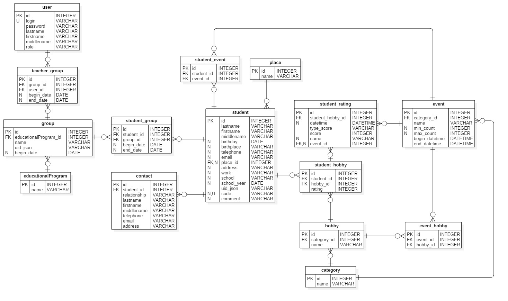
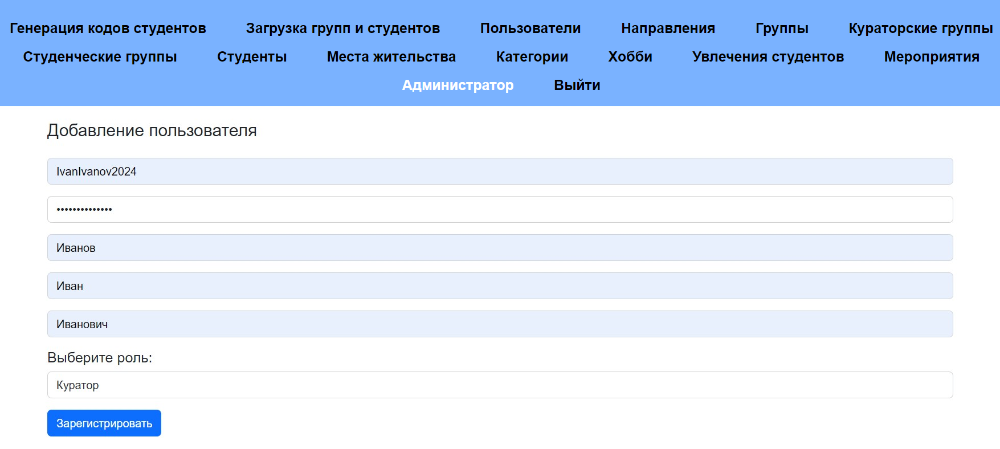
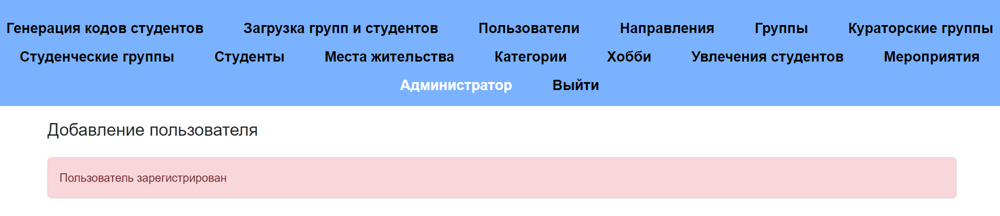
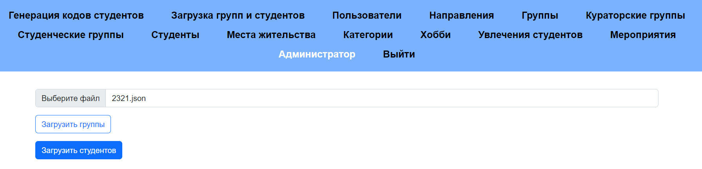
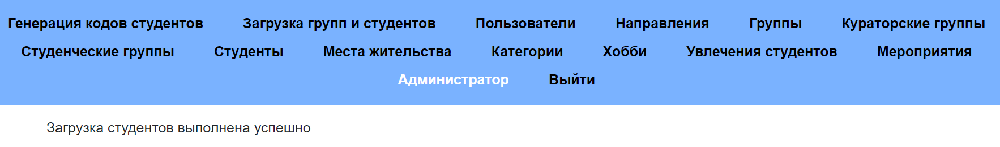
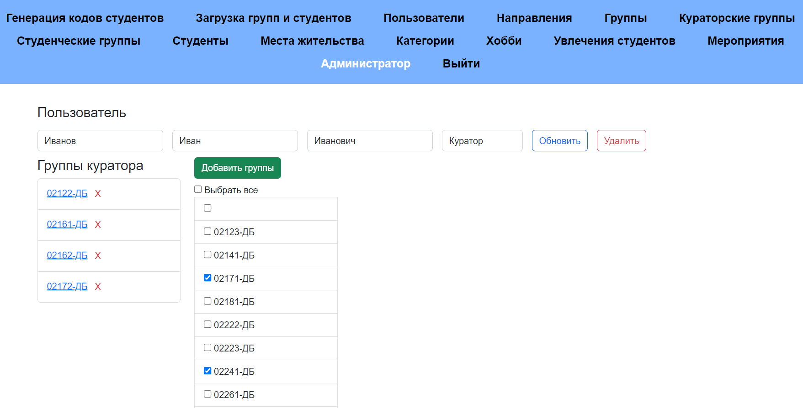
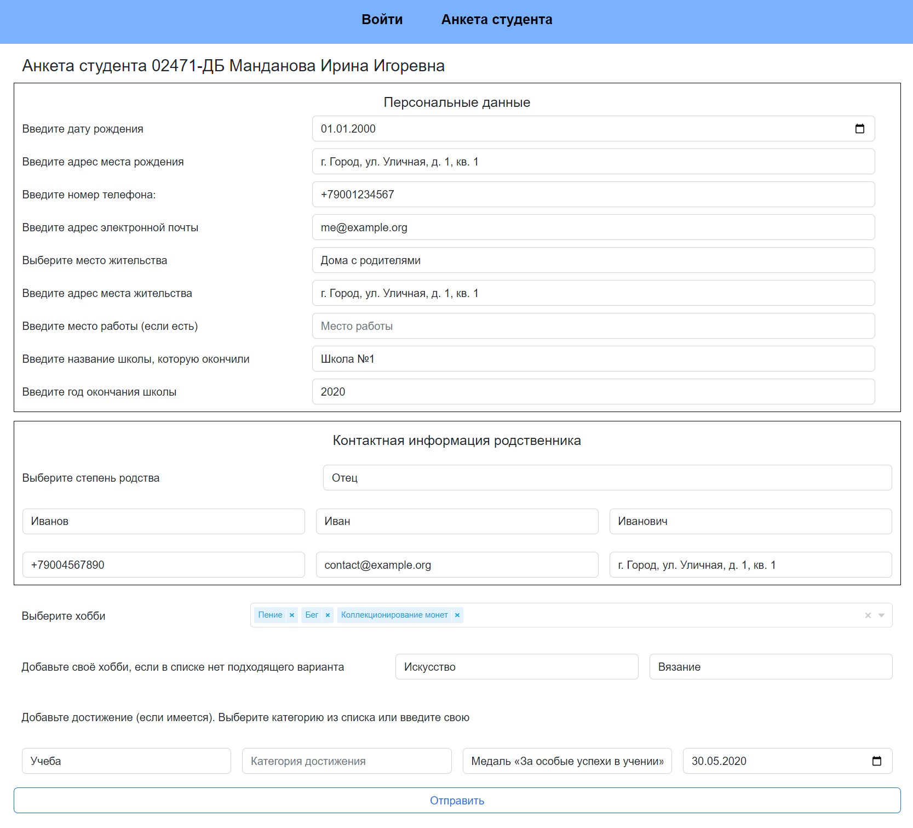
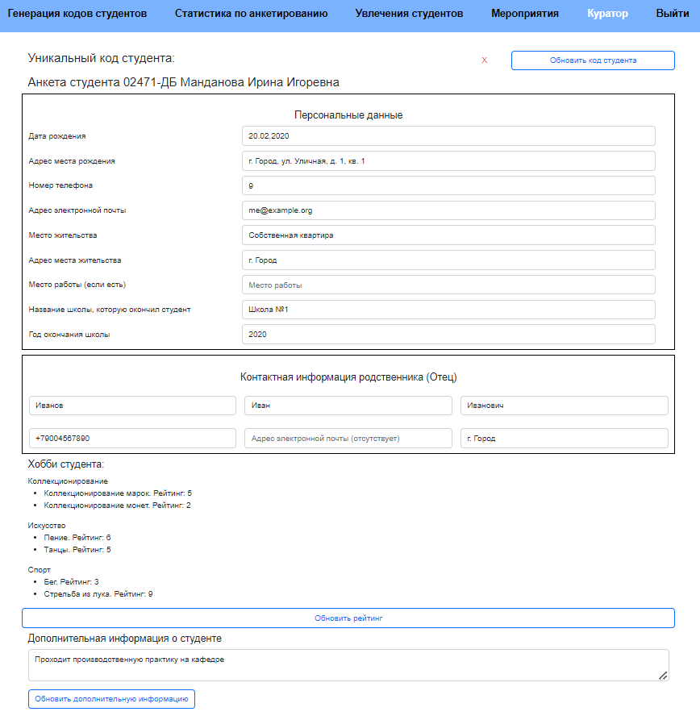
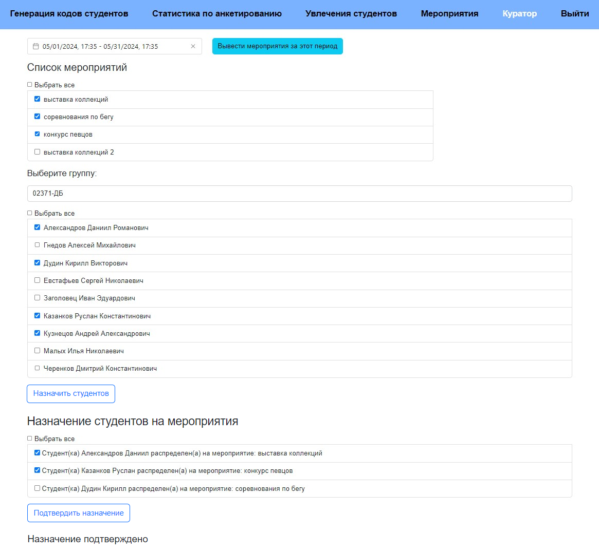

# Информационная система для куратора учебных групп.

Данная информационная система требуется для того, чтобы у кураторов учебных групп была возможность просматривать актуальную информацию о своих студентах и группах. Основными пользователями являются кураторы, которым отображаются их учебные группы, отчеты по анкетированию студентов, персональная информация студентов. Кураторам доступны лишь свои группы, администраторы имеют доступ ко всем данным системы, в том числе могут редактировать их. Незарегистрированные пользователи (студенты) не могут просматривать страницы, кроме той, где находится форма для персональных ввода данных студента.  

## Пользовательские (функциональные) требования.

1. Предоставление возможности управления информацией о студентах.
2. Предоставление возможности назначать преподавателю только те учебные группы, которые он ещё не курирует.
3. Ограничение доступа к данным студенческой группы другого куратора.
4. Предоставление возможности редактировать списки данных студентов, преподавателей, учебных дисциплин, студенческих групп и мероприятий.
5. Предоставление возможности хранения данных студентов.
6. Предоставление возможности добавления дополнительных данных о студентах.
7. Предоставление возможности управления данными мероприятий.
8. Реализация распределения студентов на мероприятия.
9. Возможность генерации отчетов по результатам анкетирования и распределения на мероприятия.
10. Измерение эффективности студента в категориях увлечений.
11. Возможность добавления и удаления студентов для мероприятий.

## База данных.
На рисунке 1 приведена структура спроектированной базы данных.

 

## Руководство пользователя.

Данное руководство предназначено для пользователей информационной системы: администратор, куратор, гость (студент).

Руководство разделено на три части:
* раздел для администратора содержит инструкции по регистрации пользователя, загрузке студенческих групп и студентов, привязке групп к кураторам;
* раздел для гостя (студента) содержит инструкцию по заполнению анкеты;
* раздел для куратора содержит инструкции по просмотру информации о студенте, настройке алгоритма назначения студентов на мероприятия и представления результатов его работы.

### Администратор.
Последовательность действий для регистрации пользователя:
1. Выбрать "Пользователи" в разделе навигации;
2. Нажать на кнопку "Добавить пользователя";
3. Ввести необходимые данные пользователя: логин, пароль, фамилия, имя, отчество;
4. Выбрать роль пользователя: администратор или куратор;
5. Нажать на кнопку "Зарегистрировать".

Пример заполнения формы регистрации пользователя показан на рисунке 2. Завершение регистрации показано на рисунке 3. Данная функция доступна администратору, он может добавлять новых администраторов и кураторов в систему. В случае необходимости администратор может изменить информацию о пользователе на странице с его данными.

 

 

Последовательность действий для загрузки студенческих групп и студентов:
1. Выгрузить необходимый файл с данными групп или студентов из информационной системы "1С: Университет ПРОФ";
2. Выбрать "Загрузка групп и студентов" в разделе навигации;
3. Нажать на кнопку "Выберите файл", для выбора будут доступны только файлы с расширением json;
4. Выбрать файл, выгруженный ранее из "1С: Университет ПРОФ"; 
5. Если это был файл с данными групп, нажать на кнопку "Загрузить группы";
6. Если это был файл с данными групп, нажать на кнопку "Загрузить студентов".

Пример загрузки студентов показан на рисунке 4. Завершение загрузки показано на рисунке 5. Данная функция доступна администратору.

 

 

Последовательность действий для привязки групп к куратору:
1. Выбрать "Пользователи" в разделе навигации;
2. Либо в выпадающем списке выбрать роль "Куратор" для отображения списка пользователей с этой ролью, далее поиск нужного куратора вручную;
3. Либо нажать на кнопку "Поиск пользователей", ввести в появившемся поле ФИО куратора (полностью или часть) и нажать на кнопку "Поиск";
4. Выбрать необходимого куратора в списке;
5. Нажать на кнопку "Добавить группы в список", в появившемся списке выбрать необходимые группы (можно выбрать все сразу, можно нажимать на отдельные), нажать на кнопку "Добавить группы". Группы, принадлежащие другому куратору, не будут отображаться в данном списке;
6. Если требуется удалить группу у куратора, необходимо нажать на крестик справа от названия данной группы в списке "Группы куратора".

Пример привязки групп к куратору показан на рисунке 6. Данная функция доступна администратору, он может добавлять и удалять группы куратора.

 

### Гость (студент).
Последовательность действий для заполнения анкеты: 
1. Выбрать "Анкета студента" в разделе навигации;
2. В поле для кода студента ввести свой уникальный код, ранее полученный от своего куратора, нажать на кнопку "Проверить";
3. Если код был введен неверно или использован ранее, появится уведомление "Код введен неверно или уже был использован"; 
4. Если код был введен верно, отобразится анкета для студента, наверху будет указан его номер группы и ФИО:
    * заполнить раздел "Персональные данные": ввести дату рождения, адрес места рождения, номер телефона, адрес электронной почты, адрес места жительства, место работы (если есть), название школы, которую окончили и год окончания школы. Все эти поля обязаны к заполнению (кроме места работы), если какое-то поле окажется пустым, система выдаст уведомление. У даты рождения, номера телефона и адреса электронной почты указаны форматы, которым необходимо следовать. Также нужно выбрать место жительства из выпадающего списка, это обязано к заполнению;
    * заполнить раздел "Контактная информация родственника": выбрать степень родства, далее ввести ФИО, адрес электронной почты и адрес место жительства родственника. Все эти поля обязаны к заполнению (кроме адреса электронной почты), если какое-то поле окажется пустым, система выдаст уведомление;
    * указать минимум одно хобби: либо выбрать нужные хобби из выпадающего списка (сначала категорию, потом конкретное хобби), либо добавить своё хобби, если подходящего варианта нет. Для этого требуется указать категорию (можно выбрать из списка или свою) и наименование хобби. Если хобби не будет указано, система выдаст уведомление;
    * по желанию добавить достижение: выбрать категорию из списка или ввести свою (при указании двух категорий система выдаст уведомление), далее ввести наименование и дату достижения;
    * после заполнения и проверки данных нажать на кнопку "Отправить", данные будут загружены в систему, а уникальный код прекратит своё действие.

Анкета студента показана на рисунке 7.

 

### Куратор.
Последовательность действий для просмотра информации о студенте:
1. Выбрать фамилию пользователя в разделе навигации (переход на страницу http://localhost:4200/profile), отобразится его личный кабинет со списком групп;
2. Выбрать группу, в которой находится необходимый студент (переход на страницу http://localhost:4200/group/:id);
3. Выбрать необходимого студента в списке студентов группы (переход на страницу http://localhost:4200/student/:id).

Страница с информацией о студенте показана на рисунке 8. 

 

Последовательность действий для назначения студентов на мероприятия:
1. Выбрать "Мероприятия" в разделе навигации;
2. Выбрать необходимый период в календаре, нажать на кнопку "Вывести мероприятия за этот период" --- отобразится список мероприятий;
3. Выбрать необходимую группу из выпадающего списка --- отобразится список студентов;
4. Отметить мероприятия и студентов, для которых требуется запустить алгоритм назначения (можно выбрать сразу всех или по отдельности), далее нажать на кнопку "Назначить студентов" --- отобразится список рекомендуемых назначений;
5. Выбрать подходящие результаты назначений, нажать на кнопку "Подтвердить назначение" --- отобразится уведомление "Назначение подтверждено".

На рисунке 9 показан пример результата работы алгоритма для назначения студентов на мероприятия.

 
